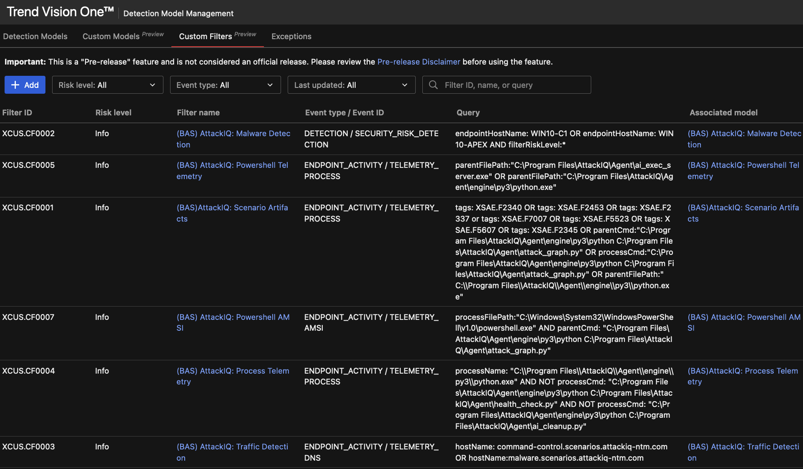
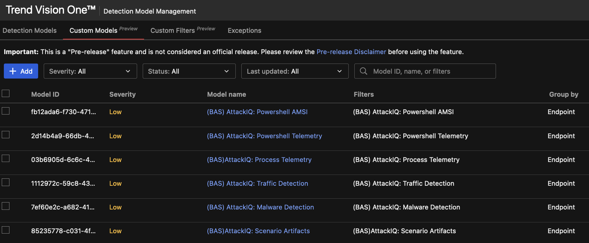
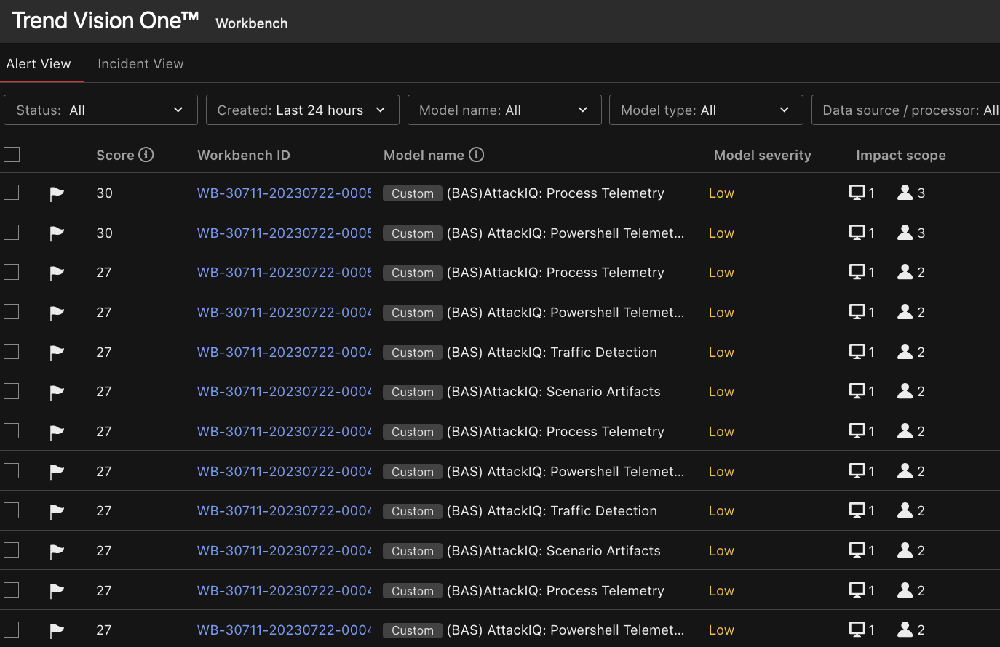
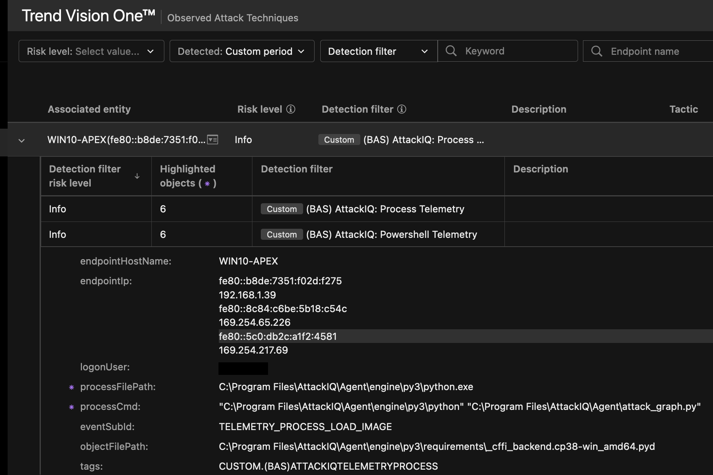
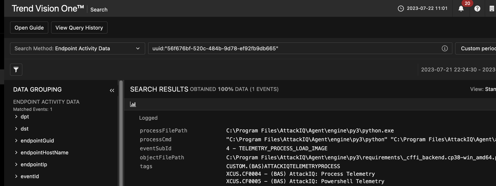

# Trend Micro Vision One AttackIQ Filter
Custom Trend Micro Vision One filters to apply detection logic and filtering for AttackIQ telemetry. 
Use these filters in conjuntion with a customer endpoint protection policy for Trend Micro Apex or Cloud One Workload: 
https://github.com/trendmicro/c1ws-mitre-policy 
https://github.com/PurpleWaveIO/apex_central_mitre_attackiq 

